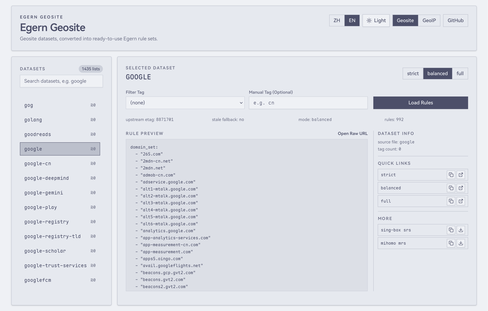

<div align="center">
  <h1>Egern Geosite / Surge Geosite</h1>
  <p>
    中文 | <a href="./README.md">English</a>
  </p>
  <p>自动转换 <a href="https://github.com/Loyalsoldier/v2ray-rules-dat">Loyalsoldier/v2ray-rules-dat</a> 数据集（geosite + geoip）为 Egern 和 Surge 可直接使用的规则集。</p>
  <p>
    <a href="https://egern.slinet.moe"><strong>Egern 面板</strong></a>
    &nbsp;|&nbsp;
    <a href="https://surge.slinet.moe"><strong>Surge 面板</strong></a>
  </p>
</div>

<p align="center">
  
</p>

## Egern

### 直接使用

1. 打开可视化面板：<https://egern.slinet.moe>。
2. 搜索并选择数据集。
3. 复制页面给出的原始链接。
4. 在 Egern 的 `rule_set` 规则中引用。

如果你要直接使用规则链接，格式是：

- 推荐规则路径：`https://egern.slinet.moe/geosite/:name_with_filter.yaml`
- 兼容路径（同样可用）：`https://egern.slinet.moe/geosite/:name_with_filter`
- GeoIP 规则路径：`https://egern.slinet.moe/geoip/:country_code.yaml`
- GeoIP 跳过 DNS 解析：`https://egern.slinet.moe/geoip/:country_code.yaml?no_resolve=true`

`name_with_filter` 有两种：

- 不带 filter：`apple`
  返回 `apple` 这个数据集的完整规则。
- 带 filter：`apple@cn`
  只返回带 `@cn` 标签的规则。

`country_code` 示例：

- `cn`
  返回 `CN` 这个 GeoIP 数据集转换后的 CIDR 规则。

Egern 引用示例：

```yaml
rules:
  - rule_set:
      match: "https://egern.slinet.moe/geosite/apple@cn.yaml"
      policy: DIRECT
      update_interval: 86400
  - rule_set:
      match: "https://egern.slinet.moe/geosite/proxy-list.yaml"
      policy: Proxy
      update_interval: 86400
  - rule_set:
      match: "https://egern.slinet.moe/geoip/cn.yaml?no_resolve=true"
      policy: DIRECT
      update_interval: 86400
```

### Egern API

- `GET /geosite`
- `GET /geosite/:name_with_filter` 或 `GET /geosite/:name_with_filter.yaml`
- `GET /geosite/:mode/:name_with_filter` 或 `GET /geosite/:mode/:name_with_filter.yaml`（兼容旧路径，返回 308 跳转）
- `GET /geoip`
- `GET /geoip/:country_code` 或 `GET /geoip/:country_code.yaml`
- `GET /geoip/:country_code?no_resolve=true` 或 `GET /geoip/:country_code.yaml?no_resolve=true`

当前 geosite 输出已无模式，且上游 `regexp` 规则会无损输出为 `domain_regex_set`。

## Surge

### 快速上手

1. 打开可视化面板：<https://surge.slinet.moe>。
2. 搜索并选择数据集。
3. 选择正则转换档位。
4. 复制页面给出的 `.list` 链接，在 Surge `RULE-SET` 中引用。

如果你要直接使用规则链接，格式是：

- Geosite 规则路径：`https://surge.slinet.moe/geosite/:name_with_filter.list`
- 指定正则转换档位：`https://surge.slinet.moe/geosite/:name_with_filter.list?regex_mode=standard`
- GeoIP 规则路径：`https://surge.slinet.moe/geoip/:country_code.list`
- GeoIP 跳过 DNS 解析：`https://surge.slinet.moe/geoip/:country_code.list?no_resolve=true`

**正则转换档位** — V2Ray `regexp:` 条目匹配域名，而 Surge `URL-REGEX` 匹配完整 URL，因此需要转换。`regex_mode` 参数控制转换策略：

| 档位               | 行为                                                                                                                                                                                                                                 |
| ------------------ | ------------------------------------------------------------------------------------------------------------------------------------------------------------------------------------------------------------------------------------ |
| `skip`             | 所有 `regexp:` 条目直接丢弃                                                                                                                                                                                                          |
| `standard`（默认） | 转换那些仍可安全视为 host-only URL 模式的条目：精确域名（`^x$`）、可选子域后缀（`(^\|\\.)x$`）、一般的尾部锚定主机后缀（`x$`，包括 `javdb\d+\.com$` 这类形式），以及域名前缀（`^x`）。含前瞻、反向引用、路径符或顶层交替的条目会跳过 |
| `aggressive`       | 所有条目均去掉锚点后通用包装为 `^https?://…/`，不丢弃任何条目，但可能产生过宽或不精确的匹配                                                                                                                                          |

Surge 引用示例：

```ini
[Rule]
RULE-SET,https://surge.slinet.moe/geosite/apple@cn.list,DIRECT
RULE-SET,https://surge.slinet.moe/geosite/netflix.list?regex_mode=standard,PROXY
RULE-SET,https://surge.slinet.moe/geoip/cn.list?no_resolve=true,DIRECT
```

### Surge API

- `GET /geosite`（返回 JSON 索引）
- `GET /geosite/:name_with_filter.list`
- `GET /geosite/:name_with_filter.list?regex_mode=skip|standard|aggressive`
- `GET /geoip`（返回 JSON 索引）
- `GET /geoip/:country_code.list`
- `GET /geoip/:country_code.list?no_resolve=true`

Geosite 响应头包含正则转换统计：
`x-surge-regex-total`、`x-surge-regex-converted`、`x-surge-regex-skipped`。

---

## 维护者说明

本地开发：

```bash
pnpm install
pnpm build
pnpm test
pnpm panel:dev
pnpm worker:dev
```

部署：

```bash
pnpm panel:deploy
pnpm worker:deploy
```

技术架构文档：[docs/architecture.md](./docs/architecture.md)
